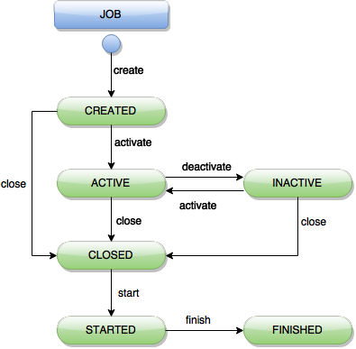
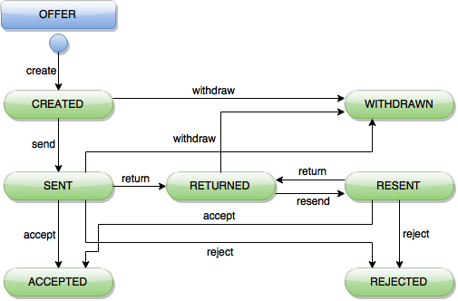
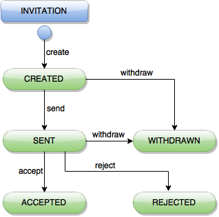
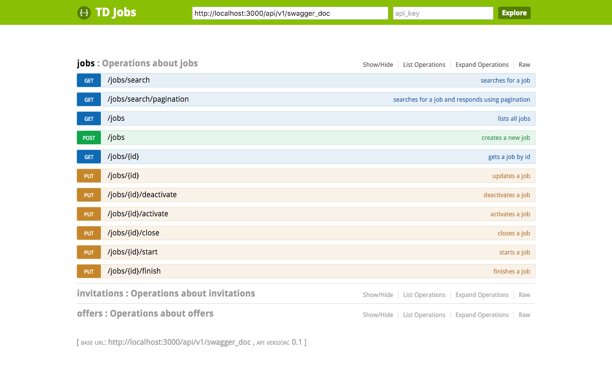

# TDJobs

TDJobs is a job marketplace process abstraction API. Concentrate on adding value
to your apps and leave the heavy lifting, offers managing and invitation sending
to TDJobs.


# Ok, but what can I do with it?

Have you seen apps like TaskRabbit, Airbnb or UpWork? They're marketplaces where
the demand for a service is met with the offer. The logic behind them is very
much alike: someone offers some service, someone needs that service,
they negotiate...

TDJobs handles all this common logic so that you don't have to worry about it:

- Creating services/ jobs postings.
- Handling roles (job owner, job offerer).
- Handling negotiation between owner and offerer.
- Jobs and offerers search.
- Job activation, deactivation.

TDJobs has a simple REST http API so that your app's backend can access it
easily.

## Table of contents

  * [Dependencies](#dependencies)
  * [Setup](#setup)
    * [TDJobs setup](#tdjobs-setup)
  * [How to get TDJobs up and running](#how-to-get-tdjobs-up-and-running)
  * [Docker setup](#docker-setup)
  * [State diagrams](#state-diagrams)
    * [Job](#job)
    * [Offer](#offer)
    * [Invitation](#invitation)
  * [API Documentation](#api-documentation)
  * [Client libraries](#client-libraries)
  * [Contributing](#contributing)

## Dependencies

TDJobs is powered by great tech. Make sure these are present in your server box:

- [Ruby](https://rvm.io/) 2.2.0+
- [Rails](http://rubyonrails.org/) 4.2.3+
- [RabbitMQ](https://www.rabbitmq.com/download.html) 3.3+
- [PostgreSQL](http://www.postgresql.org/download/) 9.4

## Setup

Make sure you have a PostgreSQL role named td_jobs with ``createdb`` attributes,
and to match the database configuration in ``config/database.yml``, where all
database settings are found.

> By default, on a development environment (RAILS_ENV = development), TDJobs
expects a PostgreSQL
role called ``td_jobs``, with ``createdb`` and ``login`` attributes, with
``td_jobs`` for password.

You can create and configure the default, development user role by running
```sh
$ psql -h 127.0.0.1 -U postgres
```
You'll be prompted for role postgres' password, then
```sh
$ CREATE ROLE td_jobs with createdb;
$ ALTER ROLE td_jobs with login;
$ \password td_jobs
```
Enter the desired password you want to set for td_jobs. By default it is
expected to be ``td_jobs``. If you set a different one, be sure to modify
``config/database.yml``.

Once the database role is configured, run

```sh
$ gem install bundler
$ bundle
$ rake db:create
$ rake db:migrate
```

The above commands will, respectively:

- install [Bundler](http://bundler.io/)
- install TDJobs's gem dependencies.
- create the database
- create all tables and columns


### TDJobs setup

Some TDJobs features can be configured:

```ruby
TDJobs.configure do |config|
  config.autoinvite = true
  config.auto_close_jobs = true
  config.auto_send_invitation = true
end
```

By default, all config values are false. A default configuration can be found in
``config/initializers/td_jobs_config.rb``.

**``auto_close_jobs``**, if set to true, the status of jobs that have met their
due date will be set to ``CLOSED`` automatically.
**``autoinvite``**, if true, will trigger inviting preconfigured users to a
newly created job.
**``auto_send_invitation``** specifies whether an invitation should be
automatically executed upon creation, effectively inviting its destination user.


## How to get TDJobs up and running

*Inside TDJobs's core folder:*

Make sure your RabbitMQ is running.
To start TDJobs's server with [Puma](http://puma.io/), run

```sh
$ puma
```
You'll see Puma's output indicating the port the server is running on, as well
as the amount of workers it's running. This configuration can be found in
TDJobs's ``config`` folder, in ``puma.rb``, where you can edit it.


## Docker setup

TDJobs and Docker are best friends. There is a ready-to-go ``Dockerfile`` and a
``docker-compose.yml`` which makes it easier to link the TDJobs container with a
PostgreSQL.
To start TDJobs with docker, make sure you have installed
[Docker](http://docs.docker.com/) and
[Compose](http://docs.docker.com/compose/install/). The best way to install them
both is by installing the
[Docker Toolbox](https://www.docker.com/docker-toolbox) if you're on OS X or
Windows.

Please note that the default host for all databases (production, test and
development), in ``database.yml`` is ``localhost``. Change it to ``db`` in order
to use it with Docker.

**IF YOU'RE NOT ON LINUX:** Make sure you have a virtual machine (VM) to use
Docker. You can create one with docker-machine:

```sh
# we'll call it dev, but you can call it whatever! :)
$ docker-machine create -d virtualbox dev
# Start the VM we just created
$ docker-machine start dev
# Set up the necessary env. variables for docker to be able to talk to the VM:
$ eval $(docker-machine env dev)
```

Then, inside TDJobs' folder, run

```sh
$ docker-compose build
$ docker-compose up
```

to build the image and run the container.

Now both TDJobs and the Postgres database are linked, but neither databases nor
tables are created, you should run migrations in the running container using:

```sh
$ docker exec -ti tdjobs_web_1 rake db:create
$ docker exec -ti tdjobs_web_1 rake db:migrate
```

Finally, if you're on Linux, go to
``http://localhost:3000``, where you'll see Rails' welcome page. On Mac OS X or
Windows, run

```sh
$ docker-machine ip dev
```

take the output IP and replace ``localhost`` with it in the above URL.

## State diagrams

TDJobs has mainly three (3) entities, **Job**, **Offer** and
**Invitation**. Here you have diagrams that shows the flow across
states they can take, but you should take a deeper look in the
[documentation](#api-documentation) section below.

#### Job
</img>

#### Offer
</img>

#### Invitation
</img>

## API Documentation

TDJobs has also an [Swagger] API documentation. Start TDJobs, go to
[http://localhost:3000/doc](http://localhost:3000/doc) and play with it.

Once opened, the [Swagger] documentation should look like this:

</img>

## Client libraries

Although TDJobs's REST interface makes it pretty straightforward to implement
from your client, a Gem is available to make it easy to manage Jobs, Offers and
everything inside TDJobs, from your Ruby backend. You can take a look
[here](https://github.com/talosdigital/TDJobsGem)!
You can also develop a new client library, and feature it here.

## Contributing

- Follow the steps in [CONTRIBUTING](CONTRIBUTING.md).


[Swagger]:http://swagger.io/
